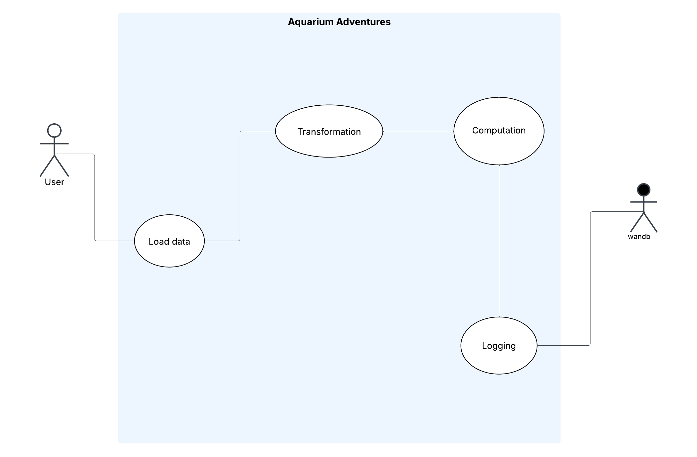
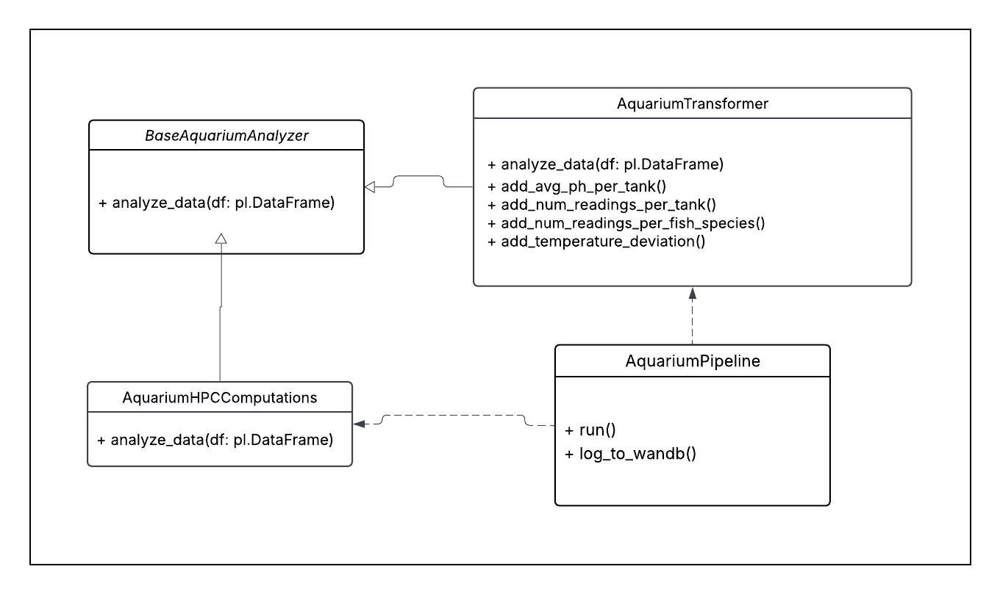
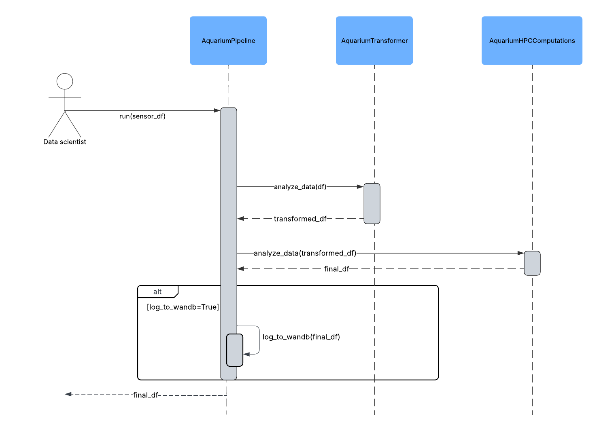

# 🐟Aquarium-Adventures

Welcome to Aquarium-Adventures! This project is designed to help you analyze and visualize aquarium data using Python. It includes a pipeline for processing data, whitch call the class that transform the data and a class that compute the stress function.

To develop this project we started with the UML diagrams: 

1. **UML Use Case Diagram**: This diagram outlines the use cases and interactions of the system with external actors, providing a high-level view of the system's functionality.



2. **UML Class Diagram**: This diagram provides an overview of the classes and their relationships within the project.



3. **UML Sequence Diagram**: This diagram illustrates the sequence of operations and interactions between the classes during the execution of the pipeline. 



## Installation and Usage💻


1. **Clone the Repository**: 
   ```bash
    git clone https://github.com/Davidermellino/Aquarium-Adventures
    cd Aquarium-Adventures
    ```

2. **Create conda environment based on the requirements file**:
   ```bash
    conda create --name aquarium-adventures python=3.10 --file requirements.txt
    conda activate aquarium-adventures
   ```

3. **Generate example data**:
    ```bash
     python data_generator.py
    ```

4. Run the pipeline with pyinstrument for profiling:
   ```bash
    pyinstrument -m aquarium_adventures.main
   ```

